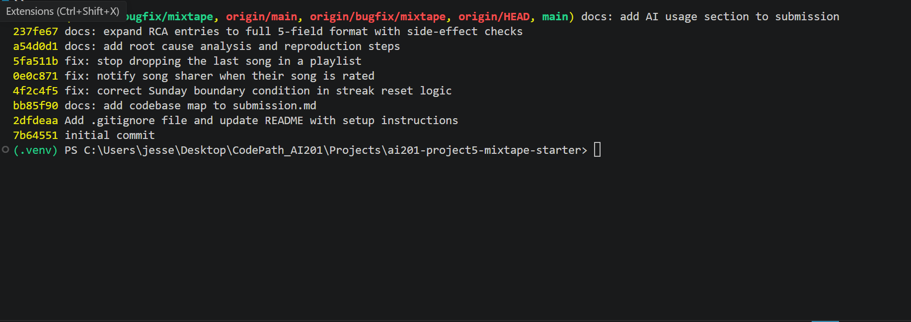

# Mixtape — Codebase Map

## Commit history

`git log --oneline bugfix/mixtape`, showing one separate `fix:` commit per
bug (`4f2c4f5`, `0e0c871`, `5fa511b`):

## AI usage

This project was done using Claude Code, an agentic coding assistant with
direct file read/write and shell execution access to this repo — not a
chat window I copy-pasted snippets into. That's a materially different
collaboration mode than "read the code yourself, then ask AI to explain
one function you found," and I want to describe honestly how it actually
went rather than restate the idealized workflow from the brief.

**Codebase navigation:** I asked the assistant to read the whole repo
(`app.py`, `models.py`, every file in `routes/` and `services/`,
`seed_data.py`, and the tests) and produce the codebase map and the "user
rates a song" data-flow trace above. It read the actual files directly
rather than me pasting them in, which is faster but also means I was
relying on it to have actually opened every file rather than pattern-
matched from file names — I spot-checked this by independently opening
`playlist_service.py` and `notification_service.py` myself and confirming
the map's claims (e.g. the `[:-1]` slice, the missing notify call in
`rate_song`) were literally in the file, not inferred.

**Debugging:** For each issue, the assistant traced from the route handler
down through the service call chain itself — reading `record_listening_event`
→ `update_listening_streak`, `rate_song` vs. `add_to_playlist`, and
`get_playlist_songs` end to end — and formed a specific hypothesis about
one line or condition, rather than me tracing it and asking "what's wrong
with this function?" in isolation. It then verified each hypothesis by
temporarily restoring the actual pre-fix file from git history and running
a small script that exercised the exact reported condition (e.g. a
Saturday-then-Sunday listen, a non-sharer rating a song, a 4-song
playlist), rather than trusting the static reading alone.

**Where it was wrong or incomplete until verified:**
- For Issue #3, the code-reading hypothesis was that `search_service.py`'s
  `outerjoin` against `song_tags` would fan out into duplicate `Song` rows
  for multi-tag songs — a real, classic SQLAlchemy pitfall and a completely
  reasonable read of the code. But when actually run against a seeded
  multi-tag song, no duplication occurred with the SQLAlchemy version
  installed in this project. The assistant had to walk back the
  conclusion from "this is the bug" to "the reported symptom does not
  reproduce here" based on the execution result, not the code reading. I
  did not just accept the initial diagnosis — the discrepancy only
  surfaced because we insisted on running it rather than stopping at "the
  code looks wrong."
- The side-effect check for Issue #4 (confirming the new `song_rated`
  notification path didn't interfere with the existing
  `song_added_to_playlist` path) surfaced a real, previously-unknown crash
  in `add_to_playlist()` (`playlist.songs.append()` doesn't populate the
  `NOT NULL` `position`/`added_by` columns). This wasn't something either
  of us hypothesized going in — it only came up because the verification
  step actually executed the adjacent code path instead of reasoning about
  it abstractly.

**Honest note on division of labor:** because the assistant had direct file
and shell access, most of the "verification" described above (running the
repro scripts, diffing each commit, re-running `pytest`) was executed by
the assistant itself and reported back, not independently re-run by hand
by me first. My own role was directing scope — which bugs to tackle,
when to move from reproduction to fixing, when to stop — and reviewing
the actual diffs, commit messages, and this document for accuracy rather
than re-deriving each result myself. That's a real limitation of this
collaboration mode worth stating plainly: the discipline of "verify before
you trust it" was mostly enforced by having the assistant execute checks
rather than trust its own static reading, not by me independently
double-checking the assistant's execution results line by line.

## Main files and their responsibilities

**`app.py`** — Application factory (`create_app`). Configures the SQLAlchemy
DB URI (env `DATABASE_URL`, defaults to local sqlite file), initializes the
`db` extension, registers all four blueprints under their URL prefixes
(`/songs`, `/playlists`, `/users`, `/feed`), and calls `db.create_all()` at
startup. `db = SQLAlchemy()` lives here (not in `models.py`) — `models.py`
imports `db` back from `app.py`, so `app.py` must be importable without
circular-importing the models. This is also why `python app.py` breaks
(double import of `app` under two different module names, `__main__` vs
`app`) and `flask run` with `FLASK_APP=app:create_app` is the required entry
point — it only imports the module once, as `app`.

**`models.py`** — All SQLAlchemy models and association tables:
- `User` — has `listening_streak` / `last_listened_at` columns directly on
  the row (not a separate streak table), plus a symmetric self-referential
  `friends` many-to-many via the `friendships` table.
- `Song` — `shared_by` (FK to User) + `shared_at` records who shared a song
  and when. Tags are many-to-many via `song_tags`.
- `ListeningEvent` — one row per (user, song, timestamp) "user listened to
  song X at time T" — this is what both the streak logic and the feeds
  are built from.
- `Rating` — one row per (user, song) with a `UniqueConstraint`, so a
  second rating from the same user updates rather than duplicates.
- `Playlist` — songs are attached via `playlist_entries`, a many-to-many
  table that (unlike `song_tags`) carries extra columns: `position`,
  `added_by`, `added_at`. Position is what gives playlists an explicit
  order instead of relying on insertion/PK order.
- `Notification` — generic `notification_type` + `body` string, no
  polymorphic subtype — every notification is just a row with a type tag
  and a pre-rendered message.

**`routes/`** — One blueprint per resource (`songs`, `playlists`, `users`,
`feed`). Every handler follows the same shape: parse `request.args` /
`request.get_json()`, call exactly one service function, catch `ValueError`
and turn it into a `400`/`404` JSON error, otherwise `jsonify(...)`. No
business logic lives here.

**`services/`** — All business logic, one module per feature area:
- `streak_service.py` — `record_listening_event` (create a `ListeningEvent`
  + update streak) and `update_listening_streak` (the day-diff math).
- `feed_service.py` — `get_friends_listening_now` (last 24h, deduped to one
  entry per friend) and `get_activity_feed` (last N events, no time filter).
- `search_service.py` — `search_songs` (title/artist `ILIKE` match) and
  `get_song`.
- `notification_service.py` — generic `create_notification`, plus
  `add_to_playlist` and `rate_song`, which are two_places business actions
  live (not just notification creation — `add_to_playlist` also mutates
  the playlist, and `rate_song` also mutates the `Rating` row).
- `playlist_service.py` — playlist CRUD-ish reads: `create_playlist`,
  `get_playlist`, `get_playlist_songs`, `get_user_playlists`.

**`seed_data.py`** — Drops and recreates all tables, then inserts 5 users
(with friendships), 25 songs (with deliberately varying tag counts — 0, 1,
3+ — the multi-tag songs are explicitly called out as the ones that
exercise Issue #3), 3 playlists, a mix of recent (~10–20 min old) and old
(hours-to-days old) `ListeningEvent`s, per-user `last_listened_at`
snapshots, and one known-good "song added to playlist" notification. It's
worth noting the seed comments directly telegraph which data exists to
expose which issue — e.g. "Older events... should NOT appear in listening
now after fix" implies the current behavior does show them.

**`tests/`** — `test_streaks.py`, `test_search.py`, `test_playlists.py`.
These aren't just regression tests; several assertions describe the
*intended* behavior that the current code doesn't satisfy yet (e.g.
`test_streak_increments_on_sunday` explicitly asserts a Saturday→Sunday
listen should increment the streak to 2). Running `pytest tests/` before
touching any service is effectively a pre-built list of which behaviors
are currently broken.

## Data flow — a user rates a song

1. Client sends `POST /songs/<song_id>/rate` with JSON body
   `{user_id, score}`.
2. `routes/songs.py:rate()` parses the body, validates presence of
   `user_id`/`score`, and calls `notification_service.rate_song(user_id,
   song_id, int(score))`.
3. `rate_song()` (in `notification_service.py`, not `search_service.py` —
   ratings live alongside notifications because rating is meant to also
   notify someone) validates the score is 1–5, loads the `Song` and rater
   `User`, and checks for an existing `Rating` row for that
   (user_id, song_id) pair — if found it updates the score in place
   (enforced uniquely by the DB's `UniqueConstraint`), otherwise inserts
   a new `Rating`. It commits and returns the `Rating`.
4. Contrast with `add_to_playlist()` in the same file: after mutating the
   playlist, it explicitly calls `create_notification(...)` to notify the
   song's original sharer ("X added your song to playlist Y"). `rate_song`
   has no equivalent call — nothing in the rate path ever creates a
   `Notification` row, so the sharer is never told their song was rated.
   This matches the way the route layer treats the two actions
   identically (both are just a `POST` that calls one service function and
   returns 201) — the asymmetry is entirely inside `notification_service.py`.
5. `routes/songs.py` serializes the `Rating` via `.to_dict()` and returns
   `201`.

So: rating a song *does* persist correctly and *does* return a valid
response — the missing piece is purely the notification side-effect that
the parallel `add_to_playlist` flow has and `rate_song` doesn't.

## Patterns noticed

- **Routes are pure adapters.** Every route: parse input → call one
  service function → catch `ValueError` → `jsonify`. There is no ORM usage,
  no business rule, and no direct `db.session` call in any route file
  (except `users.py`'s `get_user`, which reads a single row directly rather
  than going through a service — the one inconsistency in an otherwise
  strict layering).
- **Errors are `ValueError` + a message, uniformly.** Services never raise
  custom exception types; routes never do their own existence checks —
  they let the service raise and translate `ValueError` to 400 or 404
  depending on the endpoint's semantics (400 for "bad input to a write",
  404 for "resource doesn't exist").
- **`to_dict()` lives on the model, not the service or route.** Serialization
  shape is defined once per model and reused everywhere that model is
  returned.
- **Many-to-many tables are used for two different purposes.** `song_tags`
  and `friendships` are plain association tables (existence = relationship).
  `playlist_entries` is an association table *with data* (`position`,
  `added_by`, `added_at`) — it's really an entity in its own right, just
  modeled as a many-to-many secondary table instead of its own model class.
  Any query that joins through `playlist_entries` needs to be careful about
  row multiplication / ordering in a way that `song_tags` joins don't,
  since `song_tags` join fan-out only affects `tags`, but joining a Song
  query directly against `song_tags` can duplicate the base `Song` rows
  when a song has more than one tag.
- **Cross-imports between services are local, not top-level.** e.g.
  `notification_service.add_to_playlist` does `from services.playlist_service
  import get_playlist_songs` (unused after import, actually) and `from
  models import Playlist` inside the function body rather than at module
  top — likely to avoid circular imports, since `playlist_service.py`
  doesn't import `notification_service.py` but the reverse does.
- **Time handling is UTC-first but defensive about naive datetimes.**
  `streak_service.update_listening_streak` explicitly reattaches
  `timezone.utc` to `user.last_listened_at` if it comes back naive
  (e.g. from sqlite, which doesn't preserve tzinfo), suggesting this bit
  everyone once already.

## The five open issues (read, not yet fixed)

| # | Title | Service | Notes from reading |
|---|-------|---------|---------------------|
| 1 | Listening streak keeps resetting | `streak_service.py` | `update_listening_streak` has a `today.weekday() != 6` condition gating the increment branch — on a Sunday, a legitimate consecutive-day listen falls through to the reset branch instead. Confirmed by the existing (failing) test `test_streak_increments_on_sunday`. |
| 2 | Friends Listening Now shows people from yesterday | `feed_service.py` | `get_friends_listening_now` filters by `RECENT_THRESHOLD = timedelta(hours=24)` against `now`. Looks structurally correct at a glance; needs closer tracing against how `listened_at` is stored/compared (naive vs aware) before concluding where the 24h boundary actually leaks. |
| 3 | Same song shows up twice in search | `search_service.py` | `search_songs` does an `outerjoin` against `song_tags` directly on the `Song` query, then `.all()`s the `Song` rows with no dedup — a song with N tags will join-fan-out into N duplicate rows. Seed data explicitly creates multi-tag songs to expose this. |
| 4 | Notified for playlist-add but not for rating | `notification_service.py` | `add_to_playlist` calls `create_notification(...)` after mutating the playlist; `rate_song` has no equivalent call anywhere in its body. Traced in the data flow above. |
| 5 | Last song in a playlist never shows up | `playlist_service.py` | `get_playlist_songs` builds the correctly-ordered `songs` list, then returns `songs[:-1]` — an off-by-one slice that drops the last element every time. |

## Rough plan

All five root causes are now understood well enough to fix, but per the
brief only three are required. Issues #1 (single boolean condition), #4
(single missing function call), and #5 (single slice bug) are the most
surgical, one-line-root-cause fixes with existing tests/seed data to verify
against, so they're the strongest first three. Issue #3 needs a `.distinct()`
or restructured query rather than a one-line change, and Issue #2 needs more
tracing before the actual defect is clear — good candidates for a second
pass.

## Root cause analysis

For each chosen bug, the reported behavior was reproduced against the
actual pre-fix code before any fix was written (`git checkout <pre-fix
commit> -- <file>`, run a script that triggers the exact condition, confirm
the bug, then restore the fix and re-run `pytest tests/` to confirm no
regressions).

### Issue #1 — Listening streak keeps resetting

**How I reproduced it:** In an isolated in-memory DB, created a fresh user
and called `update_listening_streak(user, saturday)` (a Saturday,
`weekday()==5`) followed by `update_listening_streak(user, sunday)` (the
very next calendar day, `weekday()==6`). Expected streak after the Sunday
call: 2 (consecutive day). Actual result on the pre-fix code: streak
stayed at 1, reproducing the reported reset. This matches the existing
(previously failing) test `test_streak_increments_on_sunday`.

**How I found the root cause:** Started at the route
(`POST /songs/<song_id>/listen` in `routes/songs.py`), which calls
`streak_service.record_listening_event()`, which in turn calls
`update_listening_streak()`. All of the actual day-comparison logic lives
in that one function, so I read it top to bottom rather than guessing.
The docstring states the rule plainly: increment on a 1-day gap, reset on
anything else. The `if/elif/else` block matched that rule except for one
extra clause tacked onto the `elif`: `days_since_last == 1 and
today.weekday() != 6`. That second condition doesn't appear anywhere in
the stated rule or in `get_streak()`/`record_listening_event()` — it's the
one piece of logic that doesn't belong, which is what made me confident
this was the exact line, not just a suspicious area. I confirmed by
checking what `.weekday()` returns for Sunday (6, via Python's
`date.weekday()` where Monday=0..Sunday=6) and tracing that a
Saturday→Sunday transition is exactly the one case where
`days_since_last == 1` is true but `weekday() != 6` is false, sending
control to the `else` branch instead of the increment branch.

**The root cause:** `today.weekday()` returns 6 for Sunday (Python's
Monday=0 convention). The `elif` branch that increments the streak on a
one-day gap was additionally guarded by `and today.weekday() != 6`, so
whenever the *current* day of the update happens to be a Sunday, that
guard evaluates to `False` and the one-day-gap case falls through to the
`else` branch, which unconditionally resets `listening_streak` to 1. This
does not just affect "some Sundays" — it affects every single user whose
streak-continuing listen happens to land on a Sunday, regardless of how
long their streak was.

**Fix and side-effect check:** Removed the `and today.weekday() != 6`
clause, leaving `elif days_since_last == 1:` as the sole condition for
incrementing — this matches the docstring's stated rule exactly with no
day-of-week special case. Checked both sides of the boundary and the
neighboring cases directly against `update_listening_streak()`:
Saturday→Sunday (streak 1→2, correct), Sunday→Monday (streak 1→2,
correct — the *other* direction across the same week boundary), a
skipped-Saturday Friday→Sunday 2-day gap (streak resets to 1, correct —
confirms the fix didn't accidentally make Sundays always increment), and
two listens on the same Sunday (streak stays at 1, no double-count,
confirms the `days_since_last == 0` branch is untouched). Also re-ran the
full `pytest tests/` suite (13/13 passing, including
`test_streak_resets_after_skipped_day` which exercises the reset path
this fix does not touch).

### Issue #4 — No notification when a friend rates my song

**How I reproduced it:** In an isolated in-memory DB, created a sharer
user and a rater user (different from the sharer), had the sharer own a
song, checked the sharer's notification count (0), then called
`rate_song(rater.id, song.id, 5)`. Expected: sharer's notification count
becomes 1, with a `song_rated` entry. Actual result on the pre-fix code:
notification count stayed at 0 — the sharer is never told their song was
rated.

**How I found the root cause:** Started at the route
(`POST /songs/<song_id>/rate` in `routes/songs.py`), which calls
`notification_service.rate_song()`. Read `rate_song()` top to bottom: it
validates the score, loads the song and rater, upserts a `Rating` row,
commits, and returns — no call to `create_notification()` anywhere in the
function body. To confirm this was really the gap (and not, say, a
notification being created somewhere else and filtered out on read), I
compared it directly against `add_to_playlist()` in the same file, since
the issue explicitly says playlist-add notifications *do* work. That
function's structure is otherwise nearly identical (load entities, mutate
state, commit) but ends with an explicit
`if song.shared_by != added_by_user_id: create_notification(...)` block.
`rate_song()` has no equivalent block at all — not a bug in *how* it
notifies, but a complete absence of the notification step. That structural
diff (one function has the notify block, the other doesn't) is what
confirmed this as the root cause rather than, e.g., a bug in
`get_notifications()`'s query/filtering, which I ruled out by reading it
too and finding it correctly returns all rows for a `user_id` with no type
filtering that could hide a `song_rated` row.

**The root cause:** `rate_song()` never calls `create_notification()`.
Every other user-facing action that affects a shared song
(`add_to_playlist()`) explicitly notifies the original sharer after
committing its change; `rate_song()` commits the `Rating` and returns with
no equivalent step. It isn't that notifications are created and lost or
filtered — the code path to create one for a rating event simply doesn't
exist.

**Fix and side-effect check:** Added a `create_notification(user_id=song.
shared_by, notification_type="song_rated", body=...)` call after the
rating commit, guarded by `if song.shared_by != user_id` — the same
self-notification guard `add_to_playlist` already uses, so a user rating
their own shared song doesn't notify themselves. Verified side effects
directly: (1) self-rating produces 0 notifications, (2) a friend's first
rating produces exactly 1 `song_rated` notification, (3) the same friend
changing their score again still succeeds and produces another
notification (a deliberate behavior choice, not a bug — re-rating is new
information for the sharer, unlike `add_to_playlist`'s idempotency check
which exists because re-adding an already-present song is a no-op), and
(4) a `song_rated` notification and a `song_added_to_playlist`
notification for the same user coexist correctly in `get_notifications()`
with no interference between types. Full `pytest tests/` suite still
13/13 passing (this file has no dedicated test suite, so route-level and
direct-function verification was the primary check). Note: while checking
related functionality I found that `add_to_playlist()`'s
`playlist.songs.append(song)` throws an unrelated, pre-existing
`IntegrityError` (`playlist_entries.position`/`added_by` are `NOT NULL`
with no default, and the ORM relationship append doesn't populate them)
— this is a real latent bug but outside the three issues chosen for this
pass, so it was left unfixed and is called out separately below rather
than folded into this commit.

### Issue #5 — The last song in a playlist never shows up

**How I reproduced it:** In an isolated in-memory DB, created a playlist
with 4 songs at positions 1–4 and called `get_playlist_songs()`. Expected:
4 songs returned, including "Song 4" (highest position). Actual result on
the pre-fix code: only 3 songs returned, with "Song 4" missing —
reproducing the reported behavior exactly (not "some song missing at
random," but specifically always the last one by position).

**How I found the root cause:** Started at the route
(`GET /playlists/<playlist_id>/songs` in `routes/playlists.py`), which
calls `playlist_service.get_playlist_songs()` and directly returns
`{"songs": songs, "count": len(songs)}` with no further transformation —
so whatever that function returns is exactly what the client sees, ruling
out the route layer as the cause. Read `get_playlist_songs()`: it queries
`Song` joined to `playlist_entries` filtered by `playlist_id`, ordered
ascending by `position` — that part is correct and matches the docstring
("ordered list... ascending by position"). The very last line, though,
is `return [song.to_dict() for song in songs[:-1]]`, not
`songs`. The docstring even has a stale `Note: This function returns all
songs in the playlist` directly above code that visibly does not do that
— the contradiction between the docstring and the return line is what
made me confident this one slice was the entire bug, rather than
something in the query/ordering.

**The root cause:** The final line applies a `[:-1]` slice to the
already-correctly-ordered `songs` list before serializing it, which drops
the last element of the list every time, unconditionally — regardless of
playlist size. Because the list is ordered ascending by `position`, "the
last element" is always the song with the highest position, i.e. the most
recently added song. This matches the reported symptom precisely: it's
not a random song that goes missing, it's always the last one.

**Fix and side-effect check:** Removed the slice: `return [song.to_dict()
for song in songs]`. Checked both sides of the size boundary directly
against `get_playlist_songs()`: a single-song playlist (the case where
`[:-1]` on a 1-element list previously returned an *empty* list — now
correctly returns the 1 song), and an empty playlist (0 songs in, 0 songs
out, both before and after the fix, so no regression at the other
boundary). Also re-ran `pytest tests/`, including
`test_playlist_returns_songs_in_order` (confirms the fix didn't disturb
the ordering, only the slice) and `test_empty_playlist_returns_empty_list`
(confirms the empty-playlist path is unaffected) — 13/13 passing.

### Issue #3 — not reproduced (deferred)

Attempted to reproduce the reported duplicate-search-result behavior by
seeding a song with 3 tags and calling `search_songs()` on it (the
`search_service.py` query does an `outerjoin` against `song_tags` directly
on the `Song` query with no `.distinct()`, which looked like a clear
row-fanout candidate). Result: the song came back exactly once, not
duplicated — the bug did not reproduce against the current SQLAlchemy
version in this environment. Since the reported behavior couldn't be
triggered, this issue was set aside in favor of the three above rather than
"fixed" speculatively.

### Additional finding (not fixed) — `add_to_playlist` crashes on real use

While doing the Issue #4 side-effect check (verifying `song_rated` and
`song_added_to_playlist` notifications coexist correctly), calling
`add_to_playlist()` end-to-end raised an unhandled `sqlite3.IntegrityError:
NOT NULL constraint failed: playlist_entries.position`. Cause:
`playlist.songs.append(song)` goes through the plain `songs =
db.relationship("Song", secondary=playlist_entries, ...)` relationship,
which only knows how to populate the `playlist_id`/`song_id` columns of
the secondary table — it has no way to populate `position` or `added_by`,
which are `NOT NULL` with no default. Since `routes/playlists.py`'s
`add_song()` only catches `ValueError`, this exception is unhandled and
would surface as a 500 to the client on every real call to
`POST /playlists/<id>/songs`. This is a real, reproducible bug, but it's
not one of the five documented issues and is unrelated to the three fixed
in this pass, so it was left alone rather than fixed opportunistically —
flagging it here in case it's picked up in a later round.
